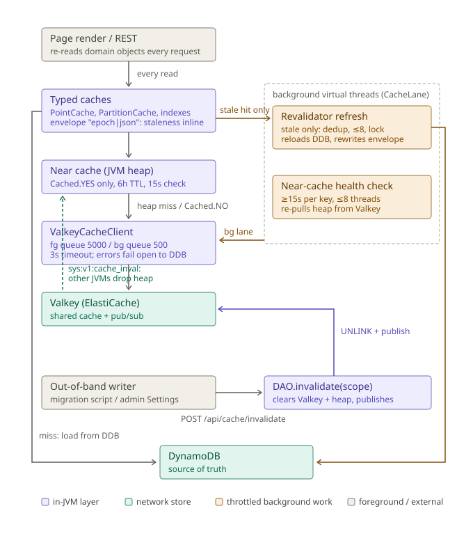

# Caching — architecture, freshness, and invalidation

Read this before touching anything in `org.paulsens.trip.cache` or a DAO read path. It reflects the
2026-08 overhaul (envelope freshness, the shared `Revalidator`, the connection bulkhead, and event-driven
invalidation) that followed the 2026-08-18 request-queue incident.

## The layers

| Layer | Class | What it holds |
|---|---|---|
| Typed caches | `PointCache`, `PartitionCache`, `PartitionScanCache`, `AdjacencyCache`, `SearchIndex`, `TripIndex` | Per-DAO access shapes over the shared cache; serialize/deserialize per read so every caller gets a fresh copy |
| Near cache | `NearCacheClient` | In-JVM heap of the delegate's raw strings/hashes, for `Cached.YES` reads of `t1:` keys only; 5m per-key converge-check, 24h hard bound (both runtime settings) |
| Shared cache | `ValkeyCacheClient` | ElastiCache Serverless Valkey; every instance shares it; survives restarts |
| Source of truth | DynamoDB | Always wins; every cache layer fails open to it |

Local mode swaps `ValkeyCacheClient` for `InMemoryCacheClient` (which then IS the datastore for
write-through data — see the local-mode notes below), `TRIP_CACHE_MODE=off` swaps in `NoopCacheClient`.

## The read path

1. Every public `DAO` read takes a `Cached` flag; `NearCacheContext.call` binds it as a `ScopedValue` so
   `NearCacheClient` knows whether the heap may answer. `Cached.NO` (edit/RMW seeds, `ForEdit` variants)
   bypasses the heap. Background threads are unbound, which deliberately reads as `Cached.NO`.
2. A near-cache hit costs zero network. A miss (or `Cached.NO`) goes to Valkey; a Valkey miss runs the
   typed cache's loader against DynamoDB and writes back through.
3. DAO reads return **copies** — the typed caches deserialize per read. Mutating a returned object does
   nothing until you save it through the DAO.

## Freshness — one mechanism, three tiers

**Tier 1 (primary): event-driven invalidation.** Writes through the DAO invalidate exactly what they
touched (write-through + `NearCacheClient`'s remove-on-write). Out-of-band writers — migration scripts,
console edits someone remembered to follow up, the admin Settings button — call `DAO.invalidate(scope)`,
which clears the scope's Valkey namespaces plus this JVM's heap, then broadcasts on the
`sys:v1:cache_inval` pub/sub channel so every other instance drops its heap copies (`CacheInvalidation`;
subscribed at startup by `web/CacheInvalidationListener`, declared in the live `web.xml` after
`TripBootstrapListener`). Scopes are `DAO.CacheScope` names — scopes, not raw prefixes, so key-layout
knowledge (person ⇒ `t1:person:` + `t1:email` + the search index) stays out of shell scripts.

**Tier 2 (backstop): soft-TTL revalidation.** Every cached value knows when it was loaded:
`PointCache` stores an envelope `"<epochMillis>|<json>"`, `PartitionCache` an in-hash `__loaded_at__`
field, the index caches a marker key. On a hit, staleness is decided **inline from data already in hand**
— a fresh hit spawns nothing and issues no extra commands. A stale hit schedules a background reload
through `Revalidator`: per-key dedup, the global `RefreshPermits` cap (8), a distributed lock, then the
reload — gates first, spawn last, always. `CacheKeys.SOFT_TTL` is 6h (indexes 24h, content 5m); it only
heals what tier 1 missed.

**Tier 3 (hygiene): `GC_TTL`** (7 days) bounds abandoned keys. Never the coherence mechanism.

The envelope is why the 2026-08-18 incident cannot recur in kind: the old `PointCache` probed a sibling
`:at` key from a spawned thread on *every hit*, ahead of every gate, so probe volume scaled with hit rate
— ~7,100 commands/sec once the near cache made hits heap-speed — and overran the shared connection's
queue. Legacy (un-enveloped) values still parse: they read as stale-once and rewrite themselves enveloped.

**Why the near-cache health check still exists at all:** the broadcast fires only for *deliberate*
invalidations — ordinary write-through does not publish per-key events. A write from another JVM (a CLI
tool with `TRIP_VALKEY_URI` set, a future second task) updates Valkey and that JVM's heap only; this
JVM's heap converges at the next health check (default 5m, `cache.near.checkSeconds`). The near-cache
TTL (default 24h, `cache.near.ttlSeconds`) is the absolute bound should both the event and the check
path fail. The heap map is deliberately unbounded — the `t1:` keyspace is a few MB by construction; note
expiry is lazy-on-read, so if the keyspace ever grows real (many tenants), the fix is a size cap with
eviction, not a shorter TTL.

## The bulkhead

`ValkeyCacheClient` holds **two** Lettuce clients over the same URI: the foreground connection
(request-path reads, queue 5000) and a background connection (queue 500). `TripThreads` binds
`CacheLane.runBackground` around every spawn, so all background work — revalidator reloads, near-cache
health checks, index rebuilds, chat-nudge hand-offs — rides the small queue and **sheds early instead of
starving the request path**. `StructuredTaskScope` forks inherit the lane, so a request's fan-out stays
foreground and a background reload's fan-out stays background. Queue overflow and command errors alike
degrade to miss/false; DynamoDB absorbs it (fail-open is the contract — a cache problem may never fail a
request).

## Invalidating from a script

Source `trip/scripts/lib/cache-invalidate.sh` and call `trip_invalidate_cache <scope>` after a live run.
Opt-in via `TRIP_APP_URL` + `TRIP_ADMIN_EMAIL` (password prompted, or `TRIP_ADMIN_PASSWORD`); it logs in
as an admin session, calls `POST /api/cache/invalidate` (CONFIG_ADMIN + `X-Trip-Api: 1`, audited), and
logs out. It is best-effort by design — anything missing prints the manual "Clear caches on admin
Settings" instruction and never fails the migration. *Future work:* a non-interactive machine token
(pre-shared secret + dedicated filter) would remove the admin-credential handling from scripts; the
session login is the only auth mechanism the API has today.

## Local-mode differences

- `InMemoryCacheClient` is the datastore for write-through data; `softRevalidate` is forced off
  (`CacheSupport`) because a rebuild against empty `FakeData` loaders would wipe seeded data.
- The near cache is deliberately NOT wrapped around `InMemoryCacheClient`.
- Pub/sub works in-process; the invalidation broadcast is a no-op with one JVM (and skipped via the
  per-JVM origin id anyway). `DAO.invalidate` still clears, so the endpoint behaves.

## Gotchas (each has caused a real bug)

- A DAO on `PartitionScanCache` must delete rows via `removeOne`, never `invalidate()` — in local mode
  the cache IS the datastore and a full invalidation deletes every other row too.
- `NoopCacheClient.tryAcquireLock` grants every lock — never use a cache lock for exclusion without
  probing the cache mode.
- Settings tuning (`cache.near.*`) must never be read on the cache read path — ConfigDAO sits ON these
  caches (the `NearCacheClient` volatile-fields + push-resync machinery exists for this cycle).
- ElastiCache Serverless needs BOTH 6379 and 6380 open (2026-07-26 outage) and has no PSUBSCRIBE —
  channel names are static.
- `DAO.clearAllCaches()` clears `t1:` only — never chat (`chat:`), auth (`auth:v1:`), or sessions.
- Read-after-write can be stale in production; pass along the object you just saved.
