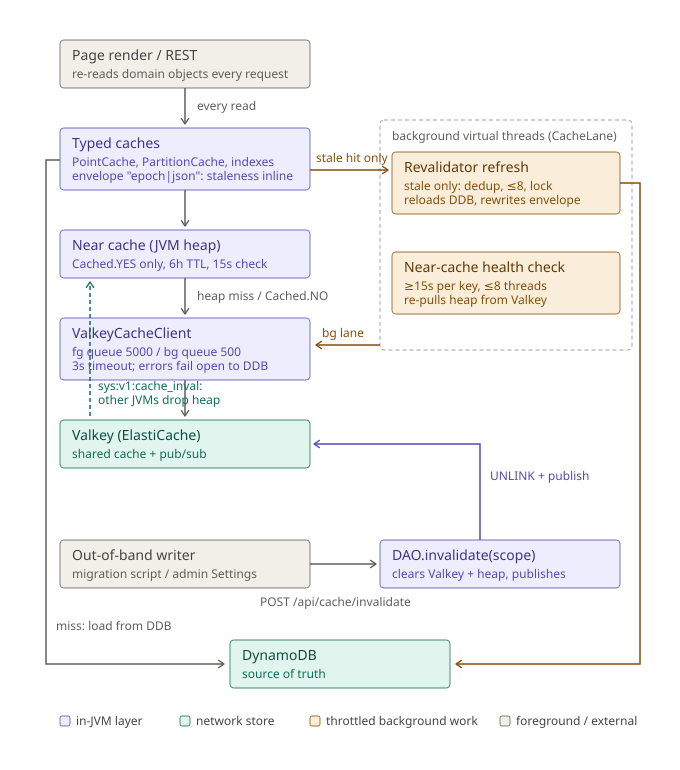

# Caching -- architecture, freshness, and invalidation

Read this before touching anything in `org.paulsens.trip.cache` or a DAO read path. It reflects the
2026-08 overhaul (envelope freshness, the shared `Revalidator`, the connection bulkhead, and event-driven
invalidation) that followed the 2026-08-18 request-queue incident.



## The layers

| Layer | Class | What it holds |
|---|---|---|
| Typed caches | `PointCache`, `PartitionCache`, `PartitionScanCache`, `AdjacencyCache`, `SearchIndex`, `TripIndex` | Per-DAO access shapes over the shared cache; serialize/deserialize per read so every caller gets a fresh copy |
| Near cache | `NearCacheClient` | In-JVM heap of the delegate's raw strings/hashes, for `Cached.YES` reads of `t1:` keys only; 5m per-key converge-check, 24h hard bound (both runtime settings) |
| Shared cache | `ValkeyCacheClient` | ElastiCache Serverless Valkey; every instance shares it; survives restarts |
| Source of truth | DynamoDB | Always wins; every cache layer fails open to it |

Local mode swaps `ValkeyCacheClient` for `InMemoryCacheClient` (which then IS the datastore for
write-through data -- see the local-mode notes below), `TRIP_CACHE_MODE=off` swaps in `NoopCacheClient`.

## The read path

1. Every public `DAO` read takes a `Cached` flag; `NearCacheContext.call` binds it as a `ScopedValue` so
   `NearCacheClient` knows whether the heap may answer. `Cached.NO` (edit/RMW seeds, `ForEdit` variants)
   bypasses the heap. Background threads are unbound, which deliberately reads as `Cached.NO`.
2. A near-cache hit costs zero network. A miss (or `Cached.NO`) goes to Valkey; a Valkey miss runs the
   typed cache's loader against DynamoDB and writes back through.
3. DAO reads return **copies** -- the typed caches deserialize per read. Mutating a returned object does
   nothing until you save it through the DAO.

## Freshness -- one mechanism, three tiers

**Tier 1 (primary): event-driven invalidation.** Writes through the DAO invalidate exactly what they
touched (write-through + `NearCacheClient`'s remove-on-write). Out-of-band writers -- migration scripts,
console edits someone remembered to follow up, the admin Settings button -- call `DAO.invalidate(scope)`,
which clears the scope's Valkey namespaces plus this JVM's heap, then broadcasts on the
`sys:v1:cache_inval` pub/sub channel so every other instance drops its heap copies (`CacheInvalidation`;
subscribed at startup by `web/CacheInvalidationListener`, declared in the live `web.xml` after
`TripBootstrapListener`). Scopes are `DAO.CacheScope` names -- scopes, not raw prefixes, so key-layout
knowledge (person ⇒ `t1:person:` + `t1:email` + the search index) stays out of shell scripts. Trip budgets
(`t1:budget:{tripId}`, one `PointCache` entry per trip, `docs/budget.md`) are the `BUDGET` scope, and trip
expense reports (`t1:expense:{tripId}`, the same shape, `docs/expense-report.md`) the `EXPENSE` scope.

**Tier 2 (backstop): soft-TTL revalidation.** Every cached value knows when it was loaded:
`PointCache` stores an envelope `"<epochMillis>|<json>"`, `PartitionCache` an in-hash `__loaded_at__`
field, the index caches a marker key. On a hit, staleness is decided **inline from data already in hand**
-- a fresh hit spawns nothing and issues no extra commands. A stale hit schedules a background reload
through `Revalidator`: per-key dedup, the global `RefreshPermits` cap (8), a distributed lock, then the
reload -- gates first, spawn last, always. `CacheKeys.SOFT_TTL` is 6h (indexes 24h, content 5m); it only
heals what tier 1 missed.

**A background reload is a compare-and-set, never an overwrite (2026-11).** The stale hit that schedules a
reload is very often the `Cached.NO` read a save makes just before it writes, so the reload's eventually
consistent query or scan races that save's own write-through and reads the row from BEFORE it. Every template
therefore applies what it loaded only where the cache is still what it was when the reload began:
`PointCache.applyBackgroundLoad` writes (or removes) only if the raw entry is still the stale one that scheduled
it (every put stamps a new envelope); `PartitionCache.mergeLoaderResult` overlays a loader row only onto a field
that still equals the pre-load snapshot; `PartitionScanCache` snapshots every registered partition before the
scan (the registry set `<loadedKey>:parts` names them) and then, per field, writes the scanned row or removes a
row the scan no longer returns only if the field is unchanged since the snapshot. Before this an unconditional
overlay put a revoked privilege back for a day (and the next grant, reading the stale holders, wrote the revoked
person into the table), and a scan-cache rebuild never removed anything, so a deleted content block a racing
rebuild had put back was served until someone cleared the caches. The compare and the write are two commands,
not one atomic step; the window left is the microseconds between them, not the length of a table scan.

Two things the compare alone gets wrong, and what covers each:

- **A key dropped during the load is a cold load.** A whole key going away (`PartitionCache.recover` after a
  failed write-through, an `invalidate`, the admin Clear caches) leaves every field missing, exactly what
  "each of these rows was removed during the load" looks like. Taken that way the reload would write nothing
  back and still mark the cache loaded: an authoritative empty answer until the soft TTL. So `PartitionCache`
  treats a loaded sentinel that was in the snapshot and is gone after the load as a drop; a COLD load over rows
  that were only written through has no sentinel, so it relies on a mark field (`__load_mark__:<id>`, a meta field
  like the sentinel: no reader takes it for a row) and treats that field's absence after the load as the drop. It
  reuses a mark another cold load left (running or failed) and plants one only when there is none, the way the scan
  cache reuses its epoch; the mark is never removed, since only a drop may take it. And
  `PartitionScanCache` plants an epoch member in its registry set at snapshot time and trusts the snapshot only
  while that member is still there (every drop takes the registry with it; a write-through after the drop
  re-creates the registry, but without the epoch). A dropped load is merged onto an EMPTY snapshot: every
  loaded row is written, except over a field a write-through has filled since the drop.
- **The loader behind a `PartitionScanCache` scans with `consistentRead(true)`.** The snapshot only protects a
  write that lands DURING the scan. A row written just before it is in the snapshot, unchanged, and an
  eventually consistent scan may not return it yet, so the rebuild would remove it and mark the cache loaded
  without it. All seven loaders (privileges, config, media, templates, content, organizations, lodging
  accommodations) therefore ask for a strongly consistent scan, through the one `JsonRows.scanAll`, which fixes
  `consistentRead(true)` so that no loader can leave it out; these are small tables scanned once per soft
  TTL, so twice the read units is nothing. `PartitionCache`'s per-partition queries are still eventually
  consistent.

**A lost version check refreshes the cached row (2026-11).** The versioned DAOs (family, budget, expense
report, organization, payment processor config, waiver document, the five lodging rows) answer a
`ConditionalCheckFailedException` with "reload and try again", and that reload reads the cache. A cache entry
still at the losing version (a write-through that failed: `PointCache.put` and `PartitionScanCache.put`
deliberately survive it, and `PartitionCache.recover`'s key drop can fail the same way) made every retry lose
again until the soft TTL. So every conflict handler calls the one `VersionedWrites.recacheStored` before
rethrowing: it re-reads the stored row and puts it into the cache. A reload, never a removal, because in local
mode the cache is the store. The re-read is a STRONGLY CONSISTENT `GetItem`, made inside the helper so no DAO
can leave it out: the winner has usually just written the new version through to this cache, and a default
read landing on a replica that has not caught up would replace it with the version that lost.

**Tier 3 (hygiene): `GC_TTL`** (7 days) bounds abandoned keys. Never the coherence mechanism.

The envelope is why the 2026-08-18 incident cannot recur in kind: the old `PointCache` probed a sibling
`:at` key from a spawned thread on *every hit*, ahead of every gate, so probe volume scaled with hit rate
-- ~7,100 commands/sec once the near cache made hits heap-speed -- and overran the shared connection's
queue. Legacy (un-enveloped) values still parse: they read as stale-once and rewrite themselves enveloped.

**Why the near-cache health check still exists at all:** the broadcast fires only for *deliberate*
invalidations -- ordinary write-through does not publish per-key events. A write from another JVM (a CLI
tool with `TRIP_VALKEY_URI` set, a future second task) updates Valkey and that JVM's heap only; this
JVM's heap converges at the next health check (default 5m, `cache.near.checkSeconds`). The near-cache
TTL (default 24h, `cache.near.ttlSeconds`) is the absolute bound should both the event and the check
path fail. The heap map is deliberately unbounded -- the `t1:` keyspace is a few MB by construction; note
expiry is lazy-on-read, so if the keyspace ever grows real (many tenants), the fix is a size cap with
eviction, not a shorter TTL.

## The people search index

`PersonDAO` searches through one `SearchIndex` (`t1:idx:people:v3`), PARTITIONED by the first two characters of each
token: a sorted set of `token|personId` entries per partition (`t1:idx:people:v3:<two chars>`) that `SearchIndex` can
only look up by PREFIX, plus ONE hash `t1:idx:people:v3:parts` whose field per partition is the epoch millis that
partition was last fully loaded. The tokens are `PersonMatch.indexTokens`: every SUFFIX of the first name, last name,
nickname and the cell's digits, plus the whole email, none shorter than two characters. A prefix lookup over suffixes
is a contains lookup, so "ulse" finds Paulsen and "5309" finds (555) 867-5309, while email stays prefix-only by owner
decision ("gmail" would match half the site). `PersonMatch` also holds the matcher the results are filtered through
and that every in-memory people list uses (`PersonCommands.listOrSearch`), so the directory search and the pages
agree.

**Two-character minimum (owner decision 2026-11-24).** Every people search refuses a query whose LONGEST word (digits
only when phone-like) is under two characters (`PersonMatch.tooShort`; "K Paulsen" is fine, "K" is not). Pages show
"Type at least 2 characters to search." (`PeopleResult.tooShort`, `CheckinCommands.Lookup.tooShort`; the searches
behind a Find button answer a plain list, so their pages read `people.queryTooShort(query)` for the same hint), the
people pickers take `minQueryLength` from `people.minQueryLength`, `GET /api/people` answers an empty list, and both
apps hint before calling it.
Since a one-character lookup never happens, one-character suffixes are not stored, and the two-character prefix of
any searchable word names exactly one partition.

**Why partitioned (2026-11-24).** The single-key `:v2` index was built by ONE ZADD of every entry in the directory
(about 25 per person, so megabytes once a directory reaches a few thousand people). That one command can exceed
the 3 s command timeout; when it did, the loaded marker was never set, so EVERY search rescanned the person table
and retried the ZADD, taking seconds per search -- and while Valkey worked through it, other commands on that shard
timed out too. A partition is a few hundred entries, written in chunks of `SearchIndex.WRITE_BATCH` (1,000), and a
partition of at most 128 entries uses Valkey's compact listpack encoding.

**Per-partition markers (owner decision 2026-11-24).** A partition's field is set ONLY after every chunk of that
partition was written. A search does one HMGET of its own partition's field: present means the partition is trusted;
missing (or unparseable, or older than `GC_TTL`) means the search is answered from a full table scan -- always
correct -- that partition is written for next time, and the same scan fills every other unmarked partition in the
background (one scan per cold index, not one per partition). So a partial or failed load can never make a person
look nonexistent. Partitions are marked even when empty, so a query nobody matches does not rescan until the daily
rebuild, which drops the field of every partition the load no longer produces (any two characters make a partition,
so restamping would keep every made-up prefix forever). A cold load is single-flight and reused for 60 s
(`reuseWindow`), so a burst of never-seen prefixes costs one table scan; a search answered from a reused load also
reads its partition key, so a person saved after the load is still found. A field counts only while younger than
`GC_TTL`, and a partition's key expiry is pushed out BEFORE its field is written, so a field can never outlive the
entries it vouches for. The same hash is the partition registry: `invalidate` and the daily reconcile enumerate it
(no SCAN). Write-through (`update`) ZADDs/ZREMs only the tokens a save changed, into a partition whether or not it
is loaded (harmless: a load re-adds everything); drift from a failed write is healed by the daily rebuild. When the
searched partition's field is older than `INDEX_SOFT_TTL` (a day), a lock-guarded background rebuild reloads every
partition and reconciles away entries the load no longer produces.

The index window is read in token order (`limit * 3` ids), so a short word common across the site can fill it;
`PersonDAO.Search.cut` says so, and the admin People page then asks for a narrower search. The abandoned `:v2` key
ages out on `GC_TTL`. Size is roughly 25 entries per person (about 3 KB in Valkey).

**Resolving the rows.** The admin People search reads `Cached.YES` (owner decision 2026-11-24: the rows are a
display, and the near cache saves a Valkey round trip per row). `PersonDAO.resolvePeople` forks one virtual thread
per id so the cache reads go out together and Lettuce pipelines them; only misses that fall through to DynamoDB are
bounded (16 at once). Measured 2026-11-24 on a local 3-shard cluster (180 ids): one GET at a time 9.0 ms, concurrent
GETs 0.9 ms, one MGET 1.0 ms -- the cluster client splits an MGET into one command per hash slot anyway, so it buys
nothing, and no single command came near the 10 ms slow-log threshold (server-side max 113 us).

## The bulkhead

`ValkeyCacheClient` holds **two** Lettuce clients over the same URI: the foreground connection
(request-path reads, queue 5000) and a background connection (queue 500). `TripThreads` binds
`CacheLane.runBackground` around every spawn, so all background work -- revalidator reloads, near-cache
health checks, index rebuilds, chat-nudge hand-offs -- rides the small queue and **sheds early instead of
starving the request path**. `StructuredTaskScope` forks inherit the lane, so a request's fan-out stays
foreground and a background reload's fan-out stays background. Queue overflow and command errors alike
degrade to miss/false; DynamoDB absorbs it (fail-open is the contract -- a cache problem may never fail a
request).

## Outside the data namespace

Not everything in Valkey is a cache of DynamoDB: `chat:v1:`, `push:v1:`, `auth:v1:`, `pub:v1:` and the app's own
metrics (`metrics:v1:`, `docs/metrics.md`) live outside `t1:` on purpose, so `DAO.clearAllCaches()` (which clears
`t1:` only) never touches them. The metrics are the store of record for their week of numbers, written once a
minute on the background lane; a cache clear is one of the moments they exist to show.

## Invalidating from a script

Source `trip/scripts/lib/cache-invalidate.sh` and call `trip_invalidate_cache <scope>` after a live run.
Opt-in via `TRIP_APP_URL` + `TRIP_ADMIN_EMAIL` (password prompted, or `TRIP_ADMIN_PASSWORD`); it logs in
as an admin session, calls `POST /api/cache/invalidate` (CONFIG_ADMIN + `X-Trip-Api: 1`, audited), and
logs out. It is best-effort by design -- anything missing prints the manual "Clear caches on admin
Settings" instruction and never fails the migration. *Future work:* a non-interactive machine token
(pre-shared secret + dedicated filter) would remove the admin-credential handling from scripts; the
session login is the only auth mechanism the API has today.

## Local-mode differences

- `InMemoryCacheClient` is the datastore for write-through data; `softRevalidate` is forced off
  (`CacheSupport`) because a rebuild against empty `FakeData` loaders would wipe seeded data.
- Local mode on a REAL Valkey (`trip.cache.local.useConfigured`, the pipeline's integration test) keeps
  `softRevalidate` ON, so the scan caches rebuild against `InMemoryPersistence`, and a rebuild removes what its
  scan does not return. Every table behind a `PartitionScanCache` must therefore be registered in
  `InMemoryPersistence.TABLES`: privileges and config were not, every scan of them came back empty, and the
  first full read removed every seeded role (pipeline run f3752b04, 2026-11-13). `ScanCachedDAOTest` fails for
  any scan-cached table missing from `TABLES`: it reads through every DAO that holds a `PartitionScanCache`, and
  fails as well when a DAO in `org.paulsens.trip.dynamo` holds one that it does not read through.
- The near cache is deliberately NOT wrapped around `InMemoryCacheClient`.
- Pub/sub works in-process; the invalidation broadcast is a no-op with one JVM (and skipped via the
  per-JVM origin id anyway). `DAO.invalidate` still clears, so the endpoint behaves.

## Sessions -- serialization and `serialVersionUID`

Sessions live in Valkey through Redisson, and Redisson writes them with Kryo's `JavaSerializer` -- plain
Java serialization of everything in `sessionScope` **and** `viewScope` (`STATE_SAVING_METHOD=server` folds
the view into the session). Without an explicit `serialVersionUID` the JVM derives one from the class
shape, so a class that gains a field makes every session written before the deploy unreadable: that is the
2026-08-14 outage (`Trip` gained `badgeImages`, every returning visitor got a 500 until
`SessionRecoveryFilter` learned to turn the unreadable blob into a clean re-login).

Two tests hold the line, and every session-borne change has to satisfy both:

- **The pin.** Every `Serializable` class under `org.paulsens.trip.model` (recursively, nested types
  included) and every view-held row type outside it (`RegRow`, `ChatSummary`, `PrivacyView`, the payment
  `Quote`/`Completion`, ...) declares `private static final long serialVersionUID = 1L;`.
  `ModelSerializationTest.everySerializableClassPinsItsSerialVersionUID` sweeps `model`, `action` and
  `chat` and fails with the exact line to add.
- **The golden streams.** `SerializationCompatibilityTest` keeps one JDK-serialized instance per
  session-borne type in `trip/src/test/resources/serialized/<SimpleName>.ser` and reads every one back on
  each build, checking identity fields against what the factory wrote. A stream that deserializes but reads
  garbage fails just like one that throws.

When `SerializationCompatibilityTest` fails after you changed a class, apply THE RULE:

- If the change is **compatible** -- a new field with a safe default, a removed field -- keep the
  `serialVersionUID` and regenerate that class's fixture.
- If objects written before the change would be **unsafe to read** -- a field that must never be null, a
  changed meaning -- bump the class's `serialVersionUID` AND regenerate. The bump is a deliberate one-time
  re-login for every session holding that class, handled by `SessionRecoveryFilter`. Say so in the commit.

Regenerate (then commit the `.ser` files with the change):

```sh
cd trip/trip && mvn -q test -Dtest=SerializationCompatibilityTest -Dserialization.regenerate=true
```

The pinning itself (2026-09-02) shifted every computed UID once, so the deploy that shipped it was a
one-time re-login for everyone. Verify any deploy touching these classes with a **pre-deploy cookie** -- a
cookie-less curl or an incognito window is blind to exactly this failure.

## Gotchas (each has caused a real bug)

- A DAO on `PartitionScanCache` must delete rows via `removeOne`, never `invalidate()` -- in local mode
  the cache IS the datastore and a full invalidation deletes every other row too.
- `NoopCacheClient.tryAcquireLock` grants every lock -- never use a cache lock for exclusion without
  probing the cache mode.
- Settings tuning (`cache.near.*`) must never be read on the cache read path -- ConfigDAO sits ON these
  caches (the `NearCacheClient` volatile-fields + push-resync machinery exists for this cycle).
- ElastiCache Serverless needs BOTH 6379 and 6380 open (2026-07-26 outage) and has no PSUBSCRIBE --
  channel names are static.
- `DAO.clearAllCaches()` clears `t1:` only -- never chat (`chat:`), auth (`auth:v1:`), or sessions.
- Read-after-write can be stale in production; pass along the object you just saved.
